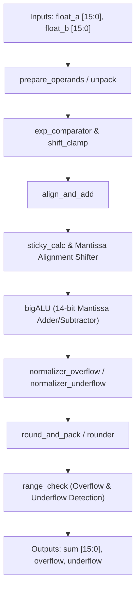

# Assignment 2: 16-Bit Floating Point Adder (FPA)

This directory contains the Logisim circuit design, block diagram, test cases, and official specifications for the **16-bit Floating Point Adder (FPA)** implemented for the CSE 210 Computer Architecture Sessional course at BUET.

---

## 📑 Table of Contents

- [Overview & Pipeline Stages](#overview--pipeline-stages)
- [16-Bit Floating-Point Representation](#16-bit-floating-point-representation)
- [Circuit Architecture & Modular Subcircuits](#circuit-architecture--modular-subcircuits)
- [Algorithmic Workflow](#algorithmic-workflow)
  - [1. Operand Unpacking & Exponent Comparison](#1-operand-unpacking--exponent-comparison)
  - [2. Mantissa Alignment & Sticky Bit Computation](#2-mantissa-alignment--sticky-bit-computation)
  - [3. Mantissa Addition / Subtraction](#3-mantissa-addition--subtraction)
  - [4. Normalization (Overflow & Underflow Handling)](#4-normalization-overflow--underflow-handling)
  - [5. Rounding (Round to Nearest, Ties to Even)](#5-rounding-round-to-nearest-ties-to-even)
  - [6. Exception Handling & Packing](#6-exception-handling--packing)
- [How to Simulate in Logisim](#how-to-simulate-in-logisim)
- [File Manifest](#file-manifest)

---

## 🔍 Overview & Pipeline Stages

Floating-point addition requires aligning binary fractions with unequal exponents, performing signed addition or subtraction, normalizing the result back to standard floating-point format, rounding, and detecting boundary exceptions (overflow and underflow).

The implementation in [`FPA3.circ`](./FPA3.circ) divides this complex datapath into distinct, modular, hierarchical stages:



---

## 📐 16-Bit Floating-Point Representation

The format uses a 16-bit word length modeled after IEEE 754 half-precision standards:

```text
 15    14           10 9                                    0
+----+----------------+--------------------------------------+
| S  |   E (5 bits)   |             F (10 bits)              |
+----+----------------+--------------------------------------+
```

- **Sign Bit ($S$):** Bit 15 (`0` for positive, `1` for negative).
- **Exponent ($E$):** Bits 14–10 (5 bits). Exponent bias is **15** ($\text{Bias} = 2^{5-1} - 1 = 15$).
  - Effective exponent: $E_{\text{actual}} = E - 15$.
- **Fraction / Mantissa ($F$):** Bits 9–0 (10 bits).
  - Normal numbers have an implicit leading 1: $\text{Significand} = 1.F = 1 + \sum_{i=1}^{10} F_{10-i} 2^{-i}$.
  - In internal datapath calculations, a 14-bit aligned significand format is used: `[Overflow bit | Hidden 1 | 10 Fraction bits | Guard bit | Round bit]`, plus a dedicated **Sticky bit**.

---

## 🏗️ Circuit Architecture & Modular Subcircuits

The circuit [`FPA3.circ`](./FPA3.circ) is cleanly structured into the following subcircuits:

| Subcircuit Name | Primary Inputs | Primary Outputs | Functional Responsibility |
| :--- | :--- | :--- | :--- |
| `main` | `float_a[15:0]`, `float_b[15:0]` | `sum[15:0]`, `overflow`, `underflow` | Top-level integration wiring all pipeline modules |
| `prepare_operands` | `float_A`, `float_B` | `significand_A`, `significand_B`, `shift_amount_clamped`, `result_sign_pre` | Extracts fields, calculates exponent delta, determines dominant operand |
| `unpack` | `float[15:0]` | `sign`, `exponent[4:0]`, `fraction[9:0]` | Splits a 16-bit float into sign, exponent, and fraction fields |
| `exp_comparator` | `E1[4:0]`, `E2[4:0]` | `difference[4:0]`, `E1_greater` | 5-bit exponent comparison and absolute difference subtraction |
| `shift_clamp` | `exp_diff[4:0]` | `shift_amount_clamped[3:0]` | Clamps shift amounts $> 13$ to prevent shifter overflow |
| `sign_logic` | `sign_A`, `sign_B`, `E1_greater` | `mantissa_op`, `result_sign` | Determines whether to add or subtract mantissas and computes tentative sign |
| `align` | `mantissa_in[13:0]`, `shift_amount[3:0]` | `Mantissa_out[13:0]` | Right-shifts the smaller operand's significand for exponent alignment |
| `sticky_calc` | `mantissa_in[13:0]`, `shift_amount[3:0]` | `Sticky_bit` | Computes sticky bit from bits shifted out past Round position |
| `bigALU` | `A[13:0]`, `B[13:0]`, `sub` | `Sum[13:0]`, `Cout` | 14-bit parallel adder/subtractor with carry generation |
| `smallALU` | `A[4:0]`, `B[4:0]`, `sub` | `Sum[4:0]`, `Cout` | 5-bit adder/subtractor for exponent increment/decrement |
| `align_and_add` | Operands, shift control, signs | Normalized mantissa, normalized exponent, sticky bit | Executes alignment, 14-bit arithmetic, and post-sum normalization |
| `normalizer_overflow` | `mantissa_result`, `exponent_in`, `carry_out` | `mantissa_out`, `exponent_out` | Normalizes significand $\ge 2.0$ (right shift by 1, exponent $+1$) |
| `leading_zero_detector`| `mantissa_in[13:0]` | `zero_count[3:0]`, `mantissa_nonzero` | Priority encoder detecting number of leading zeros for cancellation |
| `normalizer_underflow` | `mantissa_in`, `exponent_in` | `mantissa_out`, `exponent_out` | Normalizes cancellation results (left shift by zero count, exponent $-= count$) |
| `rounder` | `mantissa_in[13:0]`, `sticky` | `mantissa_rounded[10:0]`, `round_carry` | Round-to-nearest-even using Guard, Round, and Sticky bits |
| `round_and_pack` | Normalized fields, sticky, sign | `result_final[15:0]`, flags | Coordinates rounding, packing, and overflow/underflow flag generation |
| `range_check` | `exponent_final[4:0]` | `overflow_flag`, `underflow_flag` | Checks if final exponent exceeds valid range ($E \ge 31$ or $E \le 0$) |
| `packer` | `sign`, `exponent[4:0]`, `mantissa[10:0]` | `result[15:0]` | Recombines normalized fields into IEEE 16-bit floating point output word |

---

## 🔬 Algorithmic Workflow

### 1. Operand Unpacking & Exponent Comparison
1. Both operands are unpacked into sign ($S_A, S_B$), exponent ($E_A, E_B$), and significand ($1.F_A, 1.F_B$).
2. The larger exponent is identified:
   $$\Delta E = |E_A - E_B|$$
3. The operand with the smaller exponent is selected for alignment shifting.

### 2. Mantissa Alignment & Sticky Bit Computation
- The smaller operand's significand is right-shifted by $\Delta E$ bit positions.
- Bits shifted off the low-order end are preserved via the **Guard ($G$)**, **Round ($R$)**, and **Sticky ($S$)** bits:
  $$\text{Sticky} = \bigvee \text{all bits shifted past the } R \text{ bit}$$

### 3. Mantissa Addition / Subtraction
- If effective operation is addition ($S_A == S_B$): perform 14-bit addition ($A + B$).
- If effective operation is subtraction ($S_A \neq S_B$): perform 14-bit 2's complement subtraction.

### 4. Normalization
- **Sum Overflow ($\ge 2.0$):** If an addition generates a carry out of the integer position, the mantissa is right-shifted by 1 bit and the exponent is incremented by 1.
- **Cancellation ($< 1.0$):** If subtraction yields leading zeros, the `leading_zero_detector` counts them, the mantissa is left-shifted by the count, and the exponent is decremented accordingly.

### 5. Rounding
- The rounder implements **Round to Nearest, Ties to Even**:
  - Round up if $G = 1$ and $(R \lor S \lor \text{LSB})$.
  - If rounding causes the fraction to overflow ($1.11\dots \rightarrow 10.00$), the significand is right-shifted by 1 and the exponent is incremented by 1.

### 6. Exception Handling & Packing
- **Overflow:** Triggered when the final exponent $E \ge 31$ (`11111_2`). The `overflow` flag is asserted.
- **Underflow:** Triggered when the final exponent $E \le 0$ or result underflows. The `underflow` flag is asserted.

---

## 🚀 How to Simulate in Logisim

1. **Open Circuit:**
   ```bash
   logisim Assignment-2-FPA/FPA3.circ
   ```
2. **Input Test Vectors:**
   - In the `main` circuit, locate the two 16-bit input pins: `float_a` and `float_b`.
   - Use the Poke Tool to enter 16-bit hex values from [`CSE210_Assignment2testcases.pdf`](./CSE210_Assignment2testcases.pdf).
3. **Verify Results:**
   - Check the 16-bit `sum` output pin.
   - Verify the `overflow` and `underflow` flag pins.

---

## 📂 File Manifest

- [`FPA3.circ`](./FPA3.circ): Complete, modular Logisim-evolution circuit implementing the 16-bit Floating Point Adder.
- [`CSE210_Assignment2.pdf`](./CSE210_Assignment2.pdf): Problem statement and mathematical requirements.
- [`CSE210_Assignment2testcases.pdf`](./CSE210_Assignment2testcases.pdf): Reference test vector sheet with manual conversion examples and expected outputs.
- [`FPA_BlockDiagram.pdf`](./FPA_BlockDiagram.pdf): Hardware architecture datapath and stage block diagram.
